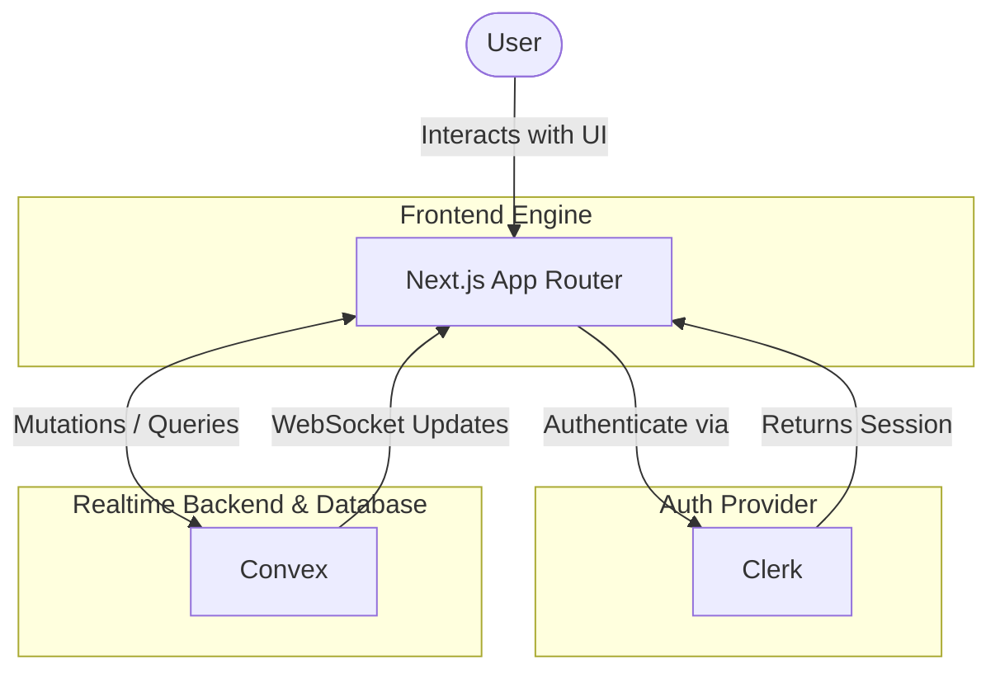

# Tars Full-stack Engineer Internship Coding Challenge

A real-time live chat app built with Next.js, TypeScript, Convex, and Clerk. Users can sign up, find others, and message in real time with a clean, responsive UI.  


## Tech Stack
- **Framework:** [Next.js (App Router)](https://nextjs.org/)
- **Language:** [TypeScript](https://www.typescriptlang.org/)
- **Backend & Database:** [Convex](https://www.convex.dev/) (Realtime updates)
- **Authentication:** [Clerk](https://clerk.com/)
- **Styling:** [Tailwind CSS](https://tailwindcss.com/) & [shadcn/ui](https://ui.shadcn.com/)

## High-Level Architecture Flow



## Features

### Core Features
- **Authentication:** Sign up, log in, log out using Clerk (Email & Social login supported). Discover other registered users stored in Convex.
- **User List & Search:** Filter registered users by name in real-time. Start conversations instantly.
- **One-on-One Direct Messages:** Private real-time messaging using Convex subscriptions. Sidebar previews the most recent messages.
- **Message Timestamps:** Smart timestamps showing time for today, date+time for older, and year for past years.
- **Empty States:** Helpful illustrations/messages for empty conversations, zero search results, etc.
- **Responsive Layout:** Sidebar + Chat on desktop, Conversation list + Fullscreen chat on mobile.

### Optional/Advanced Features
- **Online/Offline Status:** Green indicator for active users, updated in real-time.
- **Typing Indicator:** "User is typing..." animations that auto-hide.
- **Unread Message Count:** Sidebar badges for unread messages.
- **Smart Auto-Scroll:** Auto-scroll to new messages, with a "New messages" button if the user has scrolled up.
-.
- **Group Chat:** Multi-user groups with real-time sync.

## Getting Started

### Prerequisites
- Node.js (v18+)
- A [Clerk](https://clerk.com/) account for Authentication
- A [Convex](https://www.convex.dev/) account for Backend & DB

### Setup Instructions

1. **Install dependencies:**
   ```bash
   npm install
   # or
   yarn install
   ```

2. **Configure Environment Variables:**
   Create a `.env.local` file in the root directory and add your Clerk and Convex keys:
   ```env
   NEXT_PUBLIC_CLERK_PUBLISHABLE_KEY=your_clerk_pub_key
   CLERK_SECRET_KEY=your_clerk_secret_key

   CONVEX_DEPLOYMENT=your_convex_deployment # provided by `npx convex dev`
   NEXT_PUBLIC_CONVEX_URL=your_convex_url
   ```

3. **Run Convex Backend:**
   In a separate terminal, start the Convex sync:
   ```bash
   npx convex dev
   ```

4. **Run Next.js Frontend:**
   ```bash
   npm run dev
   ```
    
5. **Open the App:**
   Visit [http://localhost:3000](http://localhost:3000) in your browser.

<<<<<<< HEAD
## Presentation
- **Live Demo Link:** [Add your Vercel live demo link here](#)
- **Video Explanation:** [Add your 5-minute Loom video link here](#)
=======

## Presentation
- **Live Demo Link:**[https://tarsfullstackengineerinternshipcodi-ecru.vercel.app/]
- **Video Explanation:** [(https://www.loom.com/share/f4f39ee1c8164032a82572c0099df974)](#)

>>>>>>> ff16dcebea5929de0fab55e92a3e59bc8cfc3b1e
